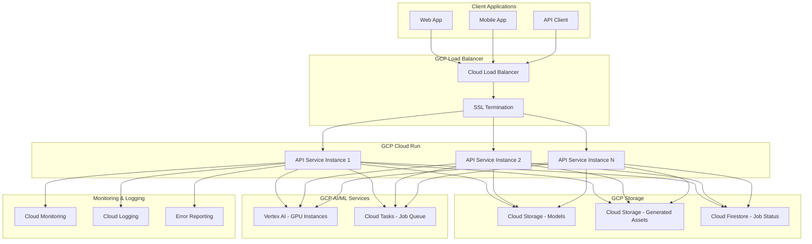

# 設計ドキュメント

## 概要

このドキュメントは、Microsoft TRELLISをGoogle Cloud Platform (GCP)上にデプロイし、REST API経由で3Dモデル生成機能を提供するシステムの設計を詳述します。また、ローカル開発用のDocker環境も含みます。

TRELLISは画像やテキストから3Dモデルを生成する深層学習パイプラインで、以下の主要コンポーネントを持ちます：
- `TrellisImageTo3DPipeline`: 画像から3Dモデル生成
- `TrellisTextTo3DPipeline`: テキストから3Dモデル生成
- 事前訓練済みモデル（Hugging Face Hub経由で配布）

## アーキテクチャ

### 全体アーキテクチャ



### デプロイメント戦略

**Cloud Run + Vertex AI ハイブリッドアプローチ**
- **API Layer**: Cloud Runで軽量なAPI サービスをホスト
- **ML Processing**: Vertex AI Custom Jobsで重い3D生成処理を実行
- **非同期処理**: Cloud Tasksでジョブキューを管理

この設計により、コスト効率性とスケーラビリティを両立します。

## コンポーネントと インターフェース

### 1. API Gateway Service (Cloud Run)

**責任**:
- REST APIエンドポイントの提供
- リクエスト検証と認証
- 非同期ジョブの作成と管理
- レスポンス形式の標準化

**主要エンドポイント**:
```
POST /api/v1/generate/image-to-3d
POST /api/v1/generate/text-to-3d
GET  /api/v1/jobs/{job_id}/status
GET  /api/v1/jobs/{job_id}/result
DELETE /api/v1/jobs/{job_id}
GET  /api/v1/health
```

**技術スタック**:
- Python 3.10 + FastAPI
- Pydantic (データ検証)
- Google Cloud Client Libraries
- Uvicorn (ASGI サーバー)

### 2. TRELLIS Processing Service (Vertex AI)

**責任**:
- TRELLISパイプラインの実行
- GPU リソースの効率的利用
- 生成された3Dモデルの後処理
- Cloud Storageへの結果保存

**処理フロー**:
1. Cloud Tasksからジョブを受信
2. 入力データをCloud Storageから取得
3. TRELLISパイプラインで3Dモデル生成
4. 結果をCloud Storageに保存
5. Firestoreでジョブステータス更新

### 3. Job Management System

**責任**:
- ジョブライフサイクル管理
- ステータス追跡
- エラーハンドリング
- リトライ機能

**コンポーネント**:
- **Cloud Tasks**: ジョブキュー
- **Cloud Firestore**: ジョブメタデータとステータス
- **Cloud Scheduler**: 定期的なクリーンアップ

### 4. Storage Layer

**Cloud Storage バケット構成**:
- `{project}-trellis-models`: 事前訓練済みモデル
- `{project}-trellis-input`: 入力データ（画像、テキスト）
- `{project}-trellis-output`: 生成された3Dモデル
- `{project}-trellis-temp`: 一時ファイル（TTL設定）

### 5. Docker Development Environment

**構成**:
- **API Service Container**: FastAPI アプリケーション
- **TRELLIS Worker Container**: GPU対応のTRELLIS処理環境
- **Redis Container**: ローカルジョブキュー
- **MinIO Container**: ローカルオブジェクトストレージ

## データモデル

### Job Model
```python
@dataclass
class Job:
    job_id: str
    user_id: str
    job_type: Literal["image-to-3d", "text-to-3d"]
    status: Literal["pending", "processing", "completed", "failed"]
    input_data: Dict[str, Any]
    output_urls: Optional[List[str]]
    error_message: Optional[str]
    created_at: datetime
    updated_at: datetime
    expires_at: datetime
```

### API Request Models
```python
class ImageTo3DRequest(BaseModel):
    image_url: Optional[str] = None
    image_base64: Optional[str] = None
    output_formats: List[str] = ["glb", "obj"]
    quality: Literal["fast", "balanced", "high"] = "balanced"
    
class TextTo3DRequest(BaseModel):
    prompt: str
    output_formats: List[str] = ["glb", "obj"]
    quality: Literal["fast", "balanced", "high"] = "balanced"
```

### API Response Models
```python
class JobResponse(BaseModel):
    job_id: str
    status: str
    estimated_completion_time: Optional[datetime]
    
class JobStatusResponse(BaseModel):
    job_id: str
    status: str
    progress: Optional[float]
    result_urls: Optional[List[str]]
    error_message: Optional[str]
```

## エラーハンドリング

### エラー分類
1. **Client Errors (4xx)**
   - 400: 無効なリクエスト形式
   - 401: 認証失敗
   - 403: 認可失敗
   - 404: ジョブが見つからない
   - 429: レート制限超過

2. **Server Errors (5xx)**
   - 500: 内部サーバーエラー
   - 502: TRELLIS処理エラー
   - 503: サービス利用不可
   - 504: 処理タイムアウト

### エラー処理戦略
- **Exponential Backoff**: 一時的な障害に対するリトライ
- **Circuit Breaker**: 連続的な障害時のサービス保護
- **Graceful Degradation**: 部分的な機能提供
- **Dead Letter Queue**: 処理不可能なジョブの隔離

## テスト戦略

### 1. Unit Tests
- API エンドポイントのテスト
- データ検証ロジックのテスト
- ジョブ管理機能のテスト

### 2. Integration Tests
- GCP サービス間の連携テスト
- TRELLIS パイプラインの統合テスト
- エンドツーエンドのワークフローテスト

### 3. Load Tests
- 同時リクエスト処理能力のテスト
- スケーリング動作のテスト
- リソース使用量の測定

### 4. Security Tests
- 認証・認可機能のテスト
- 入力データの検証テスト
- セキュリティヘッダーのテスト

### テストツール
- **pytest**: Python単体テスト
- **httpx**: API テストクライアント
- **locust**: 負荷テスト
- **docker-compose**: 統合テスト環境

## セキュリティ考慮事項

### 認証・認可
- **API Key認証**: シンプルなAPI アクセス制御
- **JWT Token**: ユーザーセッション管理
- **IAM Integration**: GCP リソースへのアクセス制御

### データ保護
- **HTTPS強制**: すべての通信の暗号化
- **データ暗号化**: Cloud Storage での保存時暗号化
- **PII除去**: ログからの個人情報除去

### ネットワークセキュリティ
- **VPC**: プライベートネットワーク
- **Cloud Armor**: DDoS保護とWAF
- **Private Service Connect**: 内部サービス通信

## 監視とロギング

### メトリクス
- **API メトリクス**: リクエスト数、レスポンス時間、エラー率
- **ジョブメトリクス**: 処理時間、成功率、キュー長
- **リソースメトリクス**: CPU、メモリ、GPU使用率

### ログ
- **構造化ログ**: JSON形式での統一ログ
- **分散トレーシング**: Cloud Traceでのリクエスト追跡
- **エラー追跡**: Error Reportingでの例外監視

### アラート
- **SLI/SLO**: サービスレベル指標の定義
- **アラートポリシー**: 閾値ベースの通知
- **ダッシュボード**: リアルタイム監視画面

## パフォーマンス最適化

### API Layer
- **Connection Pooling**: データベース接続の再利用
- **Caching**: Redis でのレスポンスキャッシュ
- **Compression**: gzip レスポンス圧縮

### ML Processing
- **Model Caching**: 事前訓練済みモデルのメモリキャッシュ
- **Batch Processing**: 複数リクエストの一括処理
- **GPU Optimization**: CUDA最適化とメモリ管理

### Storage
- **CDN**: Cloud CDN での静的コンテンツ配信
- **Lifecycle Policy**: 古いファイルの自動削除
- **Multi-region**: 地理的分散によるレイテンシ削減